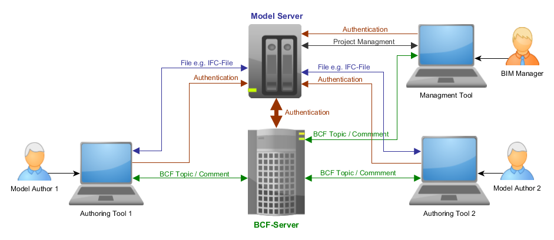

## BCF	 REST API 

**Version 1.0** based on BCFv2.
[GitHub repository](https://github.com/BuildingSMART/BCF-API)

----------

# 1. Introduction #

BCF is a format for managing issues on a BIM project. RESTful BCF-API supports the exchange of BCFv2 issues between software applications.

All API access is over HTTPS. Data is sent as query parameters and received as JSON. Every resource has a corresponding Json Schema. (There are also XSD-Schemas available but XML support ist optionally). Json Hyper Schema is used for link definition. Authentication method is OAuth2.

## 1.1 Paging, Sorting, Filtering ##

- Link header introduced by RFC 5988
- custom HTTP header  X-Total-Count (HEAD)

***page, page_size, sort***

Only „descending“ if property exits.
 
If no descending property is there ->  ascending=true

if descending=true -> descending

if descending=false -> ascending

***"&"** to combine different query parameters (operations)*

Example 1:

    .../v0.99/projects/{guid}/topics?page=1&page_size=5&sort=priority&descending=true

Example 2:

    .../v0.99/projects/{guid}/topics?page=1&page_size=5&sort=priority&descending=true&filter=(label%3DArchitecture%7Clabel%3DStructural)%26topicstatus%21%3DClosed

[Filter use escape characters](http://www.december.com/html/spec/esccodes.html)
  

## 1.2 Caching ##

ETags, or entity-tags, are an important part of HTTP, being a critical part of caching, and also used in "conditional" requests.
The ETag response-header field value, an entity tag, provides for an "opaque" cache validator.
The easiest way to think of an etag is as an MD5 or SHA1 hash of all the bytes in a representation. If just one byte in the representation changes, the etag will change.

ETags are returned in a response to a GET:

    
    joe@joe-laptop:~$ curl --include http://bitworking.org/news/
    
    HTTP/1.1 200 Ok
    
    Date: Wed, 21 Mar 2007 15:06:15 GMT
    
    Server: Apache
    
    etag: "078de59b16c27119c670e63fa53e5b51"
    
    Content-Length: 23081
    …..
  

## 1.3 Cross origin resource sharing (Cors) ##

The server will put the "Access-Control-Allow-Headers" in the response header and specify who can access the server(json) resources. The client can look for this value and proceed with accessing the resources. 

The server has  a web config file .. "*" means the server allow the resources for all domains.

    <httpProtocol>
      <customHeaders>
    	<add name="Access-Control-Allow-Headers" value="Content-Type, Accept, X-Requested-With,  Authorization" />
    	<add name="Access-Control-Allow-Methods" value="GET, POST, PUT, DELETE, OPTIONS" />
    	<add name="Access-Control-Allow-Origin" value="*" />
      </customHeaders>
     </httpProtocol>

## 1.4 Http status codes ##

-   200 OK (Data is returned)
-   201 No content (Data has been deleted)
-   302 Redirect (Returning a redirect to the GET-resource for the data that has been created/updated)
-   400 BadRequest (Input data is invalid)
-   401 Unauthorized (User don’t have access to the requested resource)
-   403 Forbidden
-   404 Not found (It must be discussed if the user should get “unauthorized” to resources he don’t have access to, or “not found")
-   422 Unprocessable entity (Input data is well formed, but the semantic is wrong; Example: Resource define that a value cannot be “null”, but the value is “null”)

## 1.5 Error response body format ##

BCF-API has a specified error response body format [error.json](https://raw.githubusercontent.com/BuildingSMART/BCF-API/master/Schemas/error.json).

----------

# Topology 1 - BCF-Server only#

Model collaboration is managed through a shared file server or a network file sharing service like Dropbox. The BCF-Server handels the Authentication and the BCF-Issues. 

## Information Services (Topology 1) ##

[version.json](https://raw.githubusercontent.com/BuildingSMART/BCF-API/master/Schemas/version.json), [link.json](https://raw.githubusercontent.com/BuildingSMART/BCF-API/master/Schemas/link.json), [colors.json](https://raw.githubusercontent.com/BuildingSMART/BCF-API/master/Schemas/colors.json)

Services:

`GET /version` 

- GET - Retrieve BCF-Version

---------- 

    GET /{version}/schemas

- GET - Retrieve link schema that contains all available schemas for Topolgy1	

---------- 

    GET /{version}/schemas/{rel}

- GET - Retrieve a specific schema.

----------

`GET /{version}/colors` 

- GET - Retrieve ARGB values for colours

----------

## Authentication (Topology 1) ##

The Authentication server is the BCF-Server. Authentication is based on the [OAuth 2.0 Protocol](http://tools.ietf.org/html/draft-ietf-oauth-v2-22).

Services:

    GET /{version}/oauth2/authorize

Open a browser window or redirect the user to this resource.

Redirects back to the specified redirect URI with the provided state as a query parameter or either...

- an authorization code as a query parameter if the user allows your app to access the account.
- the value "access_denied" in the error query parameter if the user denies access.

Long Url: -

    POST /{version}/oauth2/access_token

After you have received the authorization code you can request an access token. The access token will be returned as JSON in the response body.

The access token is an arbitrary string, guarantied to fit in a varchar(255) field.

When requesting other resources the access token must be passed via the Authorization header using the Bearer scheme *(e.g. Authorization: Bearer T9UNRV4sC9vr7ga)*.

## Project Services (Topology 1) ##

[project.json](https://raw.githubusercontent.com/BuildingSMART/BCF-API/master/Schemas/project.json), [extensions.json](https://raw.githubusercontent.com/BuildingSMART/BCF-API/master/Schemas/extensions.json)

Services:

    GET, POST /{version}/projects

- GET - Retrieve a list of projects where the currently logged on user is assigned to with his specific roles.
- POST - Add a new project

Long Url: -

    GET, PUT, DELETE /{version}/projects/{project_id}

- GET - Retrieve a specific project
- PUT - Modify a specific project
- DELETE - Delete a specific project

Long URL: -

    GET, POST, PUT, DELETE /V0.99/projects/{project_id}/extension

- GET - Retrieve the project extension schema
- POST - Add the project extension schema
- PUT - Change the project extension schema
- DELETE – Delete the project extension schema

Long URL:  /V0.99/teams/{guid}/projects/{project_id}/extensions

----------

# Topology 2 - Connected BCF-Server and Model Server#

BCF and Model server are aware of each other but are running independently (e.g. BCF Server is provided by vendor A while model server is provided by vendor B)

----------

# Topology 3 - Co-Located BCF-Server and Model Server#

BCF and model server are co located on the same hosts.

----------

## BCF Services (Toplogy 1, Topology 2, Topology3)  ##

#### *Topic* ####
[topic.json](https://raw.githubusercontent.com/BuildingSMART/BCF-API/master/Schemas/topic.json)

    GET, POST /{version}/projects/{project_id}/topics

- GET - Retrieve topics of a project (default sort = CreationDate)
- POST - Add a new topic to a project

Long URL: -

    GET, PUT, DELETE /{version}/topics/{guid}

- GET - Retrieve a specific topic
- PUT - Update a specific topic
- DELETE - Delete a specific topic

Long URL: /{version}/projects/{project_id}/topics/{guid}

----------

#### *File* ####
 [file.json](https://raw.githubusercontent.com/BuildingSMART/BCF-API/master/Schemas/file.json)

`GET /{version}/topics/{guid}/files`

- GET - Retrieve the header of a topic
- POST - Assign a file to a topic

Long URL: /{version}/projects/{project_id}/topics/{guid}/files

`DELETE /{version}/topic/{guid}/files/{reference}`

- DELETE - Remove a file from topic header

Long URL: /{version}/projects/{project_id}/topics/{guid}/revisions/{reference}

----------

#### *Comment* ####
 [comment.json](https://raw.githubusercontent.com/BuildingSMART/BCF-API/master/Schemas/comment.json)

    GET, POST /{version}/topics/{guid}/comments

- GET - Retrieve comments of a topic
- POST - Add a new comment to a topic

Long URL: /{version}/projects/{project_id}/topics/{guid}/comments

    GET, PUT, DELETE /V0.99/comments/{guid}

- GET - Retrieve a specific comment
- PUT - Update a specific comment
- DELETE - Delete a specific comment

Long URL: /{version}/projects/{project_id}/topics/{guid}/comments/{guid}

    GET, POST, DELETE /V0.99/comments/{guid}/viewpoint

- GET - Retrieve the viewpoint assigned to a comment
- POST - Assign a viewpoint to a comment
- DELETE - Delete the viewpoint assigned to a comment

Long URL: /{version}/projects/{project_id}/topics/{guid}/comments/{guid}/viewpoint

    GET, POST, DELETE /V0.99/comments/{guid}/reply_to

- GET - Retrieve the replyTo comment related to a comment
- POST - Add a replyTo comment relation to a comment
- DELETE - Delete the replyTo comment relation on a comment

Long URL: /{version}/projects/{project_id}/topics/{guid}/comments/{guid}/reply_to

----------

#### *Viewpoint* ####
 [viewpoint.json](https://raw.githubusercontent.com/BuildingSMART/BCF-API/master/Schemas/viewpoint.json)

    GET, POST /{version}/topics/{guid}/viewpoints

- GET - Retrieve viewpoints of a topic
- POST - Add a new viewpoint to a topic

Long URL: /{version}/projects/{project_id}/topics/{guid}/viewpoints

    GET, PUT, DELETE /{version}/viewpoints/{guid}

- GET - Retrieve a specific viewpoint
- PUT - Modify a specific viewpoint
- DELETE – Delete a specific viewpoint

Long URL: /{version}/projects/{project_id}/topics/{guid}/viewpoints/{guid}

    GET, POST, DELETE /{version}/viewpoints/{guid}/bitmap

- GET - Retrieve the bitmap related to a viewpoint
- PUT - Add a bitmap to the viewpoint
- DELETE – Delete the bitmap of the viewpoint

Long URL: /{version}/projects/{project_id}/topics/{guid}/viewpoints/{guid}/bitmap

#### *Component* ####
 [component.json](https://raw.githubusercontent.com/BuildingSMART/BCF-API/master/Schemas/component.json)

    GET, POST /{version}/viewpoints/{guid}/components

- GET - Retrieve components of a viewpoint
- POST - Add a new component to a viewpoint

Long URL: /{version}/projects/{project_id}/topics/{guid}/viewpoints/{guid}/components

    GET, PUT, DELETE /{version}/components/{ifc_guid}

- GET - Retrieve a specific component
- PUT - Modify a specific component
- DELETE – Delete a specific component

Long URL: /{version}/projects/{project_id}/topics/{guid}/viewpoints/{guid}/components/{ifc_guid}

----------

#### *Related Topic* ####
 [related_topic.json](https://raw.githubusercontent.com/BuildingSMART/BCF-API/master/Schemas/related_topic.json)

    GET, POST /{version}/topics/{guid}/related_topics

- GET - Retrieve related topics to a topic
- POST - Add a new related_topic to a topic

Long URL: /{version}/projects/{project_id}/topics/{guid}/related_topics

    DELETE /{version}/topics/{guid}/related_topics/{guid}

- DELETE – Delete related topic

Long URL: /{version}/projects/{project_id}/topics/{guid}/related_topics/{guid}

----------

#### *Document Reference* ####
 [document_reference.json](https://raw.githubusercontent.com/BuildingSMART/BCF-API/master/Schemas/document_reference.json)

    GET, POST /{version}/topics/{guid}/document_references

- GET - Retrieve documents referenced on a topic
- POST - Add a new document reference to a topic

Long URL: /{version}/projects/{project_id}/topics/{guid}/document_references

    DELETE /{version}/topics/{guid}/document_references/{guid}

- GET - Retrieve a document referenced on a topic
- DELETE – Delete a document reference

Long URL: /{version}/projects/{project_id}/topics/{guid}/document_references/{guid} 

----------

