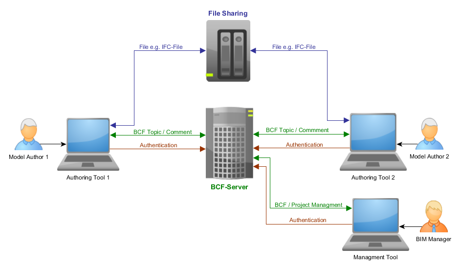
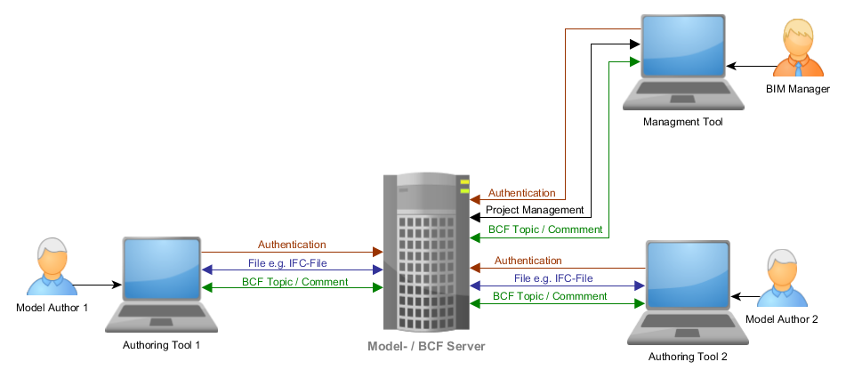

# BCF REST API

**BCFv3.0** is based on BCFv2.1.

[BCF XML GitHub repository](https://github.com/BuildingSMART/BCF-XML)

[Version 1.0 of the OpenCDE Foundation API specification is available here](https://github.com/BuildingSMART/foundation-API/tree/v1.0)

[Version 1.0 of the BCF API specification is available here](https://github.com/BuildingSMART/BCF-API/tree/v1.0)

[Version 2.1 of the BCF API specification is available here](https://github.com/BuildingSMART/BCF-API/tree/v2.1)

**Swagger / OpenAPI Specification**  
[BCF-API on SwaggerHub](https://app.swaggerhub.com/apis/buildingSMART/BCF/3.0)  
> The Swagger / OpenAPI specification is offered as a reference for implementers. The BCF group may update it and fix issues as necessary at any time.

# Contributing

The Open CDE workgroup develops the BCF standard. The group meets every second Monday at 11am CET. To join the fortnightly meeting please email [opencde@buildingsmart.org](mailto:opencde@buildingsmart.org). 

**Table of Contents**

<!-- toc -->

- [1. Introduction](#1-introduction)
  * [1.1 OpenCDE Foundation API](#11-opencde-foundation-api)
  * [1.2 Authorization](#12-authorization)
    + [1.2.1 Per-Entity Authorization](#121-per-entity-authorization)
    + [1.2.2 Determining Authorized Entity Actions](#122-determining-authorized-entity-actions)
  * [1.3 Units of Numeric Values](#13-units-of-numeric-values)
- [2. Topologies](#2-topologies)
  * [2.1 Topology 1 - BCF-Server only](#21-topology-1---bcf-server-only)
  * [2.2 Topology 2 - Colocated BCF-Server and Model Server](#22-topology-2---colocated-bcf-server-and-model-server)
- [3. BCF Services](#3-bcf-services)
  * [3.1 Project Services](#31-project-services)
    + [3.1.1 GET Projects Service](#311-get-projects-service)
    + [3.1.2 GET Project Service](#312-get-project-service)
    + [3.1.3 PUT Project Service](#313-put-project-service)
    + [3.1.4 GET Project Extension Service](#314-get-project-extension-service)
    + [3.1.5 Expressing User Authorization Through Project Extensions](#315-expressing-user-authorization-through-project-extensions)
      - [3.1.5.1 Project](#3151-project)
      - [3.1.5.2 Topic](#3152-topic)
      - [3.1.5.3 Comment](#3153-comment)
  * [3.2 Topic Services](#32-topic-services)
    + [3.2.1 GET Topics Service](#321-get-topics-service)
    + [3.2.2 POST Topic Service](#322-post-topic-service)
    + [3.2.3 GET Topic Service](#323-get-topic-service)
    + [3.2.4 PUT Topic Service](#324-put-topic-service)
    + [3.2.5 DELETE Topic Service](#325-delete-topic-service)
    + [3.2.6 GET Topic BIM Snippet Service](#326-get-topic-bim-snippet-service)
    + [3.2.7 PUT Topic BIM Snippet Service](#327-put-topic-bim-snippet-service)
    + [3.2.8 Determining Allowed Topic Modifications](#328-determining-allowed-topic-modifications)
    + [3.2.9 Topic Identifiers](#329-topic-identifiers)
  * [3.3 File Services](#33-file-services)
    + [3.3.1 GET Project Files Information Service](#331-get-project-files-information-service)
    + [3.3.2 GET Files (Header) Service](#332-get-files-header-service)
    + [3.3.3 PUT Files (Header) Service](#333-put-files-header-service)
  * [3.4 Comment Services](#34-comment-services)
    + [3.4.1 GET Comments Service](#341-get-comments-service)
    + [3.4.2 POST Comment Service](#342-post-comment-service)
    + [3.4.3 GET Comment Service](#343-get-comment-service)
    + [3.4.4 PUT Comment Service](#344-put-comment-service)
    + [3.4.5 DELETE Comment Service](#345-delete-comment-service)
    + [3.4.6 Determining allowed Comment modifications](#346-determining-allowed-comment-modifications)
  * [3.5 Viewpoint Services](#35-viewpoint-services)
    + [3.5.1 GET Viewpoints Service](#351-get-viewpoints-service)
    + [3.5.2 POST Viewpoint Service](#352-post-viewpoint-service)
      - [3.5.2.1 Point](#3521-point)
      - [3.5.2.2 Direction](#3522-direction)
      - [3.5.2.3 Orthogonal camera](#3523-orthogonal-camera)
      - [3.5.2.4 Perspective camera](#3524-perspective-camera)
      - [3.5.2.5 Line](#3525-line)
      - [3.5.2.6 Clipping plane](#3526-clipping-plane)
      - [3.5.2.7 Bitmap](#3527-bitmap)
      - [3.5.2.8 Snapshot](#3528-snapshot)
      - [3.5.2.9 Components](#3529-components)
      - [3.5.2.10 Component](#35210-component)
        * [Optimization rules](#optimization-rules)
      - [3.5.2.11 Coloring](#35211-coloring)
        * [Optimization rules](#optimization-rules-1)
      - [3.5.2.12 Visibility](#35212-visibility)
        * [Optimization rules](#optimization-rules-2)
      - [3.5.2.13 View setup hints](#35213-view-setup-hints)
    + [3.5.3 GET Viewpoint Service](#353-get-viewpoint-service)
    + [3.5.4 GET Viewpoint Snapshot Service](#354-get-viewpoint-snapshot-service)
    + [3.5.5 GET Viewpoint Bitmap Service](#355-get-viewpoint-bitmap-service)
    + [3.5.6 GET selected Components Service](#356-get-selected-components-service)
    + [3.5.7 GET colored Components Service](#357-get-colored-components-service)
    + [3.5.8 GET visibility of Components Service](#358-get-visibility-of-components-service)
    + [3.5.9 DELETE Viewpoint Service](#359-delete-viewpoint-service)
    + [3.5.10 Determining allowed Viewpoint modifications](#3510-determining-allowed-viewpoint-modifications)
   * [3.6 Related Topics Services](#36-related-topics-services)
    + [3.6.1 GET Related Topics Service](#361-get-related-topics-service)
    + [3.6.2 PUT Related Topics Service](#362-put-related-topics-service)
  * [3.7 Document Reference Services](#37-document-reference-services)
    + [3.7.1 GET Document References Service](#371-get-document-references-service)
    + [3.7.2 POST Document Reference Service](#372-post-document-reference-service)
    + [3.7.3 PUT Document Reference Service](#373-put-document-reference-service)
  * [3.8 Document Services](#38-document-services)
    + [3.8.1 GET Documents Service](#381-get-documents-service)
    + [3.8.2 POST Document Service](#382-post-document-service)
    + [3.8.3 GET Document Service](#383-get-document-service)
  * [3.9 Topics Events Services](#39-topics-events-services)
    + [3.9.1 GET Topics Events Service](#391-get-topics-events-service)
    + [3.9.2 GET Topic Events Service](#392-get-topic-events-service)
  * [3.10 Comments Events Services](#310-comments-events-services)
    + [3.10.1 GET Comments Events Service](#3101-get-comments-events-service)
    + [3.10.2 GET Comment Events Service](#3102-get-comment-events-service)

<!-- tocstop -->

# 1. Introduction

BCF is an open standard for managing issues on a BIM project. The BCF-API supports the exchange of BCF issues between software applications via a [RESTful](https://en.wikipedia.org/wiki/Representational_state_transfer) web interface, which means that data is exchanged via HTTP query parameters and JSON bodies. Every resource described in this API has a corresponding JSON schema (schema version draft-03).
URL schemas in this README are relative to the BCF servers' base URL unless absolute values are provided.

For security reasons, all API Http traffic should be sent via TLS/SSL over Https connection. Clients and Servers should both enforce secure connections and disallow unsafe connections.

An example of a client implementation in C# can be found here:
[https://github.com/rvestvik/BcfApiExampleClient](https://github.com/rvestvik/BcfApiExampleClient)

## 1.1 OpenCDE Foundation API

BCF API is a member of the OpenCDE API family. All OpenCDE APIs are united by a shared common API called [OpenCDE Foundation API](https://github.com/buildingSMART/foundation-API). 
The foundation API specifies a small number of services and a few conventions that are common to all OpenCDE APIs. All BCF API implementations must implement the Foundation API and follow its conventions and guidelines. 
Implementers should start by implementing the Foundation API and only then continue to implement the BCF API.

## 1.2 Authorization

API implementors can optionally choose to restrict the actions a user is allowed to perform on the BCF entities
via the API. The global default authorizations for all entities are expressed in the project extensions schema and can
be locally overridden in the entities themselves.

### 1.2.1 Per-Entity Authorization

Whenever a user requests an update-able entity with the query parameter `includeAuthorization` equal to `true` the
server should include an `authorization` field in the entity containing any local variations from the global
authorization defaults for that entity. Using this information clients can decide whether to, for example, include an
"Edit" button in the UI displaying the entity depending on the actions permitted for the user or suggest only the 
options available to the user for choice fields such as topic status. 

### 1.2.2 Determining Authorized Entity Actions

The client can calculate the available set of actions for a particular entity by taking the project-wide defaults from
the project extensions, then replacing any keys defined in the entity's `authorization` map with the values specified
locally. The meaning of each of the authorization keys is outlined in
[3.1.5 Expressing User Authorization through Project Extensions](#315-expressing-user-authorization-through-project-extensions).

**Example Scenario (Topic)**

This scenario assumes the topic status is set to `open`.

_In the Project Extensions_

    {
        "topic_actions": [],
        "topic_status": [
            "open",
            "closed",
            "confirmed"
        ]
    }

Indicating that by default:

* no modifications can be made to Topics
* Topics can be placed in `open`, `closed` or `confirmed` status

_In the Topic_

    {
        "authorization": {
            "topic_actions": [
                "update",
                "createComment",
                "createViewpoint"
            ],
            "topic_status": [
                "open",
                "closed"
            ]
        }
    }

Indicating that for this topic, the current user can:

* update the Topic, or add comments or viewpoints
* place the Topic into `closed` status
* leave the Topic `open` or place the topic back into `open` status after closing it

### 1.3 Units of Numeric Values

Numeric values in this specification are all in fixed units - meters for length and degrees for angle.

----------

# 2. Topologies

## 2.1 Topology 1 - BCF-Server only

Model collaboration is managed through a shared file server or a network file sharing service like Dropbox. The BCF-Server handles the authentication and the BCF-Issues.

## 2.2 Topology 2 - Colocated BCF-Server and Model Server

BCF and model server are co-located on the same hosts.

----------

# 3. BCF Services

## 3.1 Project Services

For compatibility with the project structure of existing systems, the `project_id` property of `project` resources is **not forced to be a guid but may be any string**.

### 3.1.1 GET Projects Service

**Resource URL**

    GET /bcf/{version}/projects

[project_GET.json](Schemas_draft-03/Project/project_GET.json)

Retrieve a **collection** of projects where the currently logged on user has access to.

**Example Request**

    GET /bcf/3.0/projects

**Example Response**

    Response Code: 200 - OK
    Body:
    [{
        "project_id": "F445F4F2-4D02-4B2A-B612-5E456BEF9137",
        "name": "Example project 1",
        "authorization": {
            "project_actions": [
                "createTopic",
                "createDocument"
            ]
        }
    }, {
        "project_id": "A233FBB2-3A3B-EFF4-C123-DE22ABC8414",
        "name": "Example project 2",
        "authorization": {
            "project_actions": []
        }
    }]

### 3.1.2 GET Project Service

**Resource URL**

    GET /bcf/{version}/projects/{project_id}

[project_GET.json](Schemas_draft-03/Project/project_GET.json)

Retrieve a specific project.

**Example Request**

    GET /bcf/3.0/projects/B724AAC3-5B2A-234A-D143-AE33CC18414

**Example Response**

    Response Code: 200 - OK
    Body:
    {
        "project_id": "B724AAC3-5B2A-234A-D143-AE33CC18414",
        "name": "Example project 3",
        "authorization": {
            "project_actions": [
                "update"
            ]
        }
    }

### 3.1.3 PUT Project Service

**Resource URL**

    PUT /bcf/{version}/projects/{project_id}

[project_PUT.json](Schemas_draft-03/Project/project_PUT.json)

Modify a specific project. This operation is only possible when the server returns the `update` flag in the Project authorization, see section [3.1.5](#315-expressing-user-authorization-through-project-extensions)

**Example Request**

    PUT /bcf/3.0/projects/B724AAC3-5B2A-234A-D143-AE33CC18414
    Body:
    {
        "name": "Example project 3 - Second Section"
    }

**Example Response**

    Response Code: 200 - OK
    Body:
    {
        "project_id": "B724AAC3-5B2A-234A-D143-AE33CC18414",
        "name": "Example project 3 - Second Section",
        "authorization": {
            "project_actions": [
                "update"
            ]
        }
    }

### 3.1.4 GET Project Extension Service

**Resource URL**

    GET /bcf/{version}/projects/{project_id}/extensions

[extensions_GET.json](Schemas_draft-03/Project/extensions_GET.json)

Retrieve a specific projects extensions.
Project extensions are used to define possible values that can be used in topics and comments, for example topic labels and priorities. They may change during the course of a project. The most recent extensions state which values are valid at a given moment for newly created topics and comments.

**Example Request**

    GET /bcf/3.0/projects/B724AAC3-5B2A-234A-D143-AE33CC18414/extensions

**Example Response**

    Response Code: 200 - OK
    Body:
    {
        "topic_type": [
            "Information",
            "Error"
        ],
        "topic_status": [
            "Open",
            "Closed",
            "ReOpened"
        ],
        "topic_label": [
            "Architecture",
            "Structural",
            "MEP"
        ],
        "snippet_type": [
            ".ifc",
            ".csv"
        ],
        "priority": [
            "Low",
            "Medium",
            "High"
        ],
        "users": [
            "Architect@example.com",
            "BIM-Manager@example.com",
            "bob_heater@example.com"
        ],
        "stage": [
            "Preliminary Planning End",
            "Construction Start",
            "Construction End"
        ],
        "project_actions": [
            "update",
            "createTopic",
            "createDocument"
        ],
        "topic_actions": [
            "update",
            "updateBimSnippet",
            "updateRelatedTopics",
            "updateDocumentReferences",
            "updateFiles",
            "createComment",
            "createViewpoint"
        ],
        "comment_actions": [
            "update"
        ]
    }

### 3.1.5 Expressing User Authorization Through Project Extensions

Global default authorizations for the requesting user can be expressed in the project schema. The actions authorized
here will apply to any entities that do not override them locally. The complete set of options for the BCF entities are
listed below.

#### 3.1.5.1 Project

The 'project_actions' entry in the project extensions defines what actions are allowed to be performed
at the project level. The available actions include:

* *update* - The ability to update the project details (see [3.1.3 PUT Project Service](#313-put-project-service))
* *createTopic* - The ability to create a new topic (see [3.2.2 POST Topic Service](#322-post-topic-service))
* *createDocument* - The ability to create a new document (see [3.8.2 POST Document Service](#382-post-document-service))

#### 3.1.5.2 Topic

The 'topic_actions' entry in the project extensions defines what actions are allowed to be performed at the topic
level by default (i.e. unless overridden by specific topics) The available actions include:

* *update* - The ability to update the topic (see [3.2.4 PUT Topic Service](#324-put-topic-service))
* *updateBimSnippet* - The ability to update the BIM snippet for topics (see [3.2.7 PUT Topic BIM Snippet Service](#327-put-topic-bim-snippet-service))
* *updateRelatedTopics* - The ability to update the collection of related topics (see [3.6.2 PUT Related Topics Service](#362-put-related-topics-service))
* *updateDocumentReferences* - The ability to update the collection of document references (see [3.7.3 PUT Document Reference Service](#373-put-document-reference-service))
* *updateFiles* - The ability to update the file header (see [3.3.3 PUT Files (Header) Service](#333-put-files-header-service))
* *createComment* - The ability to create a comment (see [3.4.2 POST Comment Service](#342-post-comment-service))
* *createViewpoint* - The ability to create a new viewpoint (see [3.5.2 POST Viewpoint Service](#352-post-viewpoint-service))

#### 3.1.5.3 Comment

The 'comment_actions' entry in the project extensions defines what actions are allowed to be performed at the comment level by
default (i.e unless overridden by specific comments). The available actions include:

* *update* - The ability to update the comment (see [3.4.4 PUT Comment Service](#344-put-comment-service))

---------

## 3.2 Topic Services

### 3.2.1 GET Topics Service

**Resource URL**

    GET /bcf/{version}/projects/{project_id}/topics

[topic_GET.json](Schemas_draft-03/Collaboration/Topic/topic_GET.json)

Retrieve a **collection** of topics related to a project (default sort order is `creation_date`).

**Odata filter parameters**

|parameter|type|description|
|---------|----|-----------|
|creation_author|string|userId of the creation author (value from extensions)|
|modified_author|string|userId of the modified author (value from extensions)|
|assigned_to|string|userId of the assigned person (value from extensions)|
|stage|string|stage this topic is part of (value from extensions)|
|topic_status|string|status of a topic (value from extensions)|
|topic_type|string|type of a topic (value from extensions)|
|creation_date|datetime|creation date of a topic|
|modified_date|datetime|modification date of a topic. The modification date of a server's topic should be the latest value of when the topic has been modified or when the latest [comment](#34-comment-services) has been updated or when a "floating viewpoint" (a [viewpoint](#35-viewpoint-services) which is not associated with a comment) is added|
|labels|array (string)|labels of a topic (value from extensions)|
|priority|string|priority of a topic (value from extensions)|

**Odata sort parameters**

|parameter|description|
|---------|-----------|
|creation_date|creation date of a topic|
|modified_date|modification date of a topic|
|server_assigned_id|the [server_assigned_id](#329-topic-identifiers) of the topic|
|index|index of a topic **This property is deprecated and will be removed in a future release**|

**Example Request with odata**

Get topics that are open, assigned to Architect@example.com and created after December 5th 2015. Sort the result on last modified

    GET /bcf/3.0/projects/F445F4F2-4D02-4B2A-B612-5E456BEF9137/topics?$filter=assigned_to eq 'Architect@example.com' and topic_status eq 'Open' and creation_date gt 2015-12-05T00:00:00+01:00&$orderby=modified_date desc

Odata does not support list operators. To achieve list query, use the 'or' operator.
Get topics that have at least one of the labels 'Architecture', 'Structural' or 'Heating'

    GET /bcf/3.0/projects/F445F4F2-4D02-4B2A-B612-5E456BEF9137/topics?$filter=labels/any(label: label eq 'Architecture') or labels/any(label: label eq 'Structural') or labels/any(label: label eq 'Heating')

**Example Request**

    GET /bcf/3.0/projects/F445F4F2-4D02-4B2A-B612-5E456BEF9137/topics

**Example Response**

    Response Code: 200 - OK
    Body:
    [{
        "guid": "A245F4F2-2C01-B43B-B612-5E456BEF8116",
        "server_assigned_id": "ISSUE-00001",
        "creation_author": "Architect@example.com",
        "title": "Example topic 1",
        "labels": [
            "Architecture",
            "Structural"
        ],
        "creation_date": "2013-10-21T17:34:22.409Z"
    }, {
        "guid": "A211FCC2-3A3B-EAA4-C321-DE22ABC8414",
        "server_assigned_id": "ISSUE-00078",
        "creation_author": "Architect@example.com",
        "title": "Example topic 2",
        "labels": [
            "Architecture",
            "Heating",
            "Electrical"
        ],
        "creation_date": "2014-11-19T14:24:11.316Z"
    }]

### 3.2.2 POST Topic Service

**Resource URL**

    POST /bcf/{version}/projects/{project_id}/topics

[topic_POST.json](Schemas_draft-03/Collaboration/Topic/topic_POST.json)

Add a new topic. This operation is only possible when the server returns the `createTopic` flag in the Project authorization, see section [3.1.5](#315-expressing-user-authorization-through-project-extensions)

**Parameters**

JSON encoded body using the "application/json" content type.

|Parameter|Type|Description|Required|
|---------|----|-----------|--------|
|guid|string|The desired guid. See OpenCDE Foundation section [1.5.1](https://github.com/buildingSMART/foundation-API#151-conflict-on-creation) when GUID already exists in target system.|false|
|topic_type|string|The type of a topic (value from extension.xsd)|false|
|topic_status|string|The status of a topic (value from extension.xsd)|false|
|reference_links|array (string)|Reference links, i.e. links to referenced resources|false|
|title|string|The title of a topic|true|
|priority|string|The priority of a topic (value from extension.xsd)|false|
|index|integer|The index of a topic **This property is deprecated and will be removed in a future release**|false|
|labels|array (string)|The collection of labels of a topic (values from extension.xsd)|false|
|assigned_to|string|UserID assigned to a topic (value from extension.xsd). UserIDs are recommended to be in email format as to uniquely identify users throughout multiple systems|false|
|stage|string|Stage this topic is part of (value from extension.xsd)|false|
|description|string|Description of a topic|false|
|bim_snippet.snippet_type|string|Type of a BIM-Snippet of a topic (value from extension.xsd)|false|
|bim_snippet.is_external|boolean|Is the BIM-Snippet external (default = false)|false|
|bim_snippet.reference|string|Reference of a BIM-Snippet of a topic|false|
|bim_snippet.reference_schema|string|Schema of a BIM-Snippet of a topic|false|
|due_date|string|Until when the topics issue needs to be resolved|false|

_Note: If "bim_snippet" is present, then all four properties (`snippet_type`, `is_external`, `reference` and `reference_schema`) are mandatory._

**Example Request**

    POST /bcf/3.0/projects/F445F4F2-4D02-4B2A-B612-5E456BEF9137/topics
    Body:
    {
        "topic_type": "Clash",
        "topic_status": "open",
        "title": "Example topic 3",
        "priority": "high",
        "labels": [
            "Architecture",
            "Heating"
        ],
        "assigned_to": "harry.muster@example.com",
        "bim_snippet": {
            "snippet_type": "clash",
            "is_external": true,
            "reference": "https://example.com/bcf/1.0/ADFE23AA11BCFF444122BB",
            "reference_schema": "https://example.com/bcf/1.0/clash.xsd"
        }
    }

**Example Response**

    Response Code: 201 - Created
    Body:
    {
        "guid": "A245F4F2-2C01-B43B-B612-5E456BEF8116",
        "server_assigned_id": "ISSUE-01462",
        "creation_author": "Architect@example.com",
        "creation_date": "2016-08-01T17:34:22.409Z",
        "topic_type": "Clash",
        "topic_status": "open",
        "title": "Example topic 3",
        "priority": "high",
        "labels": [
            "Architecture",
            "Heating"
        ],
        "assigned_to": "harry.muster@example.com",
        "bim_snippet": {
            "snippet_type": "clash",
            "is_external": true,
            "reference": "https://example.com/bcf/1.0/ADFE23AA11BCFF444122BB",
            "reference_schema": "https://example.com/bcf/1.0/clash.xsd"
        }
    }

### 3.2.3 GET Topic Service

**Resource URL**

    GET /bcf/{version}/projects/{guid}/topics/{guid}

[topic_GET.json](Schemas_draft-03/Collaboration/Topic/topic_GET.json)

Retrieve a specific topic.

**Example Request**

    GET /bcf/3.0/projects/F445F4F2-4D02-4B2A-B612-5E456BEF9137/topics/B345F4F2-3A04-B43B-A713-5E456BEF8228

**Example Response**

    Response Code: 200 - OK
    Body:
    {
        "guid": "B345F4F2-3A04-B43B-A713-5E456BEF8228",
        "server_assigned_id": "ISSUE-00549",
        "creation_author": "Architect@example.com",
        "creation_date": "2016-08-01T17:34:22.409Z",
        "topic_type": "Clash",
        "topic_status": "open",
        "title": "Example topic 3",
        "priority": "high",
        "labels": [
            "Architecture",
            "Heating"
        ],
        "assigned_to": "harry.muster@example.com",
        "bim_snippet": {
            "snippet_type": "clash",
            "is_external": true,
            "reference": "https://example.com/bcf/1.0/ADFE23AA11BCFF444122BB",
            "reference_schema": "https://example.com/bcf/1.0/clash.xsd"
        },
        "authorization": {
            "topic_actions": [
                "createComment",
                "createViewpoint"
            ]
        }
    }

### 3.2.4 PUT Topic Service

**Resource URL**

    PUT /bcf/{version}/projects/{project_id}/topics/{guid}

[topic_PUT.json](Schemas_draft-03/Collaboration/Topic/topic_PUT.json)

Modify a specific topic, description similar to POST. This operation is only possible when the server returns the `update` flag in the Topic authorization, see section [3.2.8](#328-determining-allowed-topic-modifications)

**Example Request**

    PUT /bcf/3.0/projects/F445F4F2-4D02-4B2A-B612-5E456BEF9137/topics/B345F4F2-3A04-B43B-A713-5E456BEF8228
    Body:
    {
        "topic_type": "Clash",
        "topic_status": "open",
        "title": "Example topic 3 - Changed Title",
        "priority": "high",
        "labels": [
            "Architecture",
            "Heating"
        ],
        "assigned_to": "harry.muster@example.com",
        "bim_snippet": {
            "snippet_type": "clash",
            "is_external": true,
            "reference": "https://example.com/bcf/1.0/ADFE23AA11BCFF444122BB",
            "reference_schema": "https://example.com/bcf/1.0/clash.xsd"
        }
    }

**Example Response**

    Response Code: 200 - OK
    Body:
    {
        "guid": "B345F4F2-3A04-B43B-A713-5E456BEF8228",
        "server_assigned_id": "ISSUE-00037",
        "creation_author": "Architect@example.com",
        "creation_date": "2016-08-01T17:34:22.409Z",
        "modified_author": "Architect@example.com",
        "modified_date": "2016-08-02T13:22:22.409Z",
        "topic_type": "Clash",
        "topic_status": "open",
        "title": "Example topic 3 - Changed Title",
        "priority": "high",
        "labels": [
            "Architecture",
            "Heating"
        ],
        "assigned_to": "harry.muster@example.com",
        "bim_snippet": {
            "snippet_type": "clash",
            "is_external": true,
            "reference": "https://example.com/bcf/1.0/ADFE23AA11BCFF444122BB",
            "reference_schema": "https://example.com/bcf/1.0/clash.xsd"
        }
    }

### 3.2.5 DELETE Topic Service

**Resource URL**

    DELETE /bcf/{version}/projects/{project_id}/topics/{guid}

Deletes a single topic. This operation is only possible when the server returns the `delete` flag in the Topic authorization, see section [3.2.8](#328-determining-allowed-topic-modifications)

**Example Request**

    DELETE /bcf/3.0/projects/F445F4F2-4D02-4B2A-B612-5E456BEF9137/topics/B345F4F2-3A04-B43B-A713-5E456BEF8228

**Example Response**

    Response Code: 200 - OK

### 3.2.6 GET Topic BIM Snippet Service

**Resource URL**

    GET /bcf/{version}/projects/{project_id}/topics/{guid}/snippet

Retrieves a topics BIM-Snippet as binary file.

### 3.2.7 PUT Topic BIM Snippet Service

**Resource URL**

    PUT /bcf/{version}/projects/{project_id}/topics/{guid}/snippet

Puts a new BIM Snippet binary file to a topic. If this is used, the parent topics BIM Snippet property `is_external` must be set to `false` and the `reference` must be the file name with extension. This operation is only possible when the server returns the `updateBimSnippet` flag in the Topic authorization, see section [3.2.8](#328-determining-allowed-topic-modifications)

### 3.2.8 Determining Allowed Topic Modifications

The global default Topic authorizations are expressed in the project schema and when Topic(s) are requested with the
query parameter "includeAuthorization" equal to "true" Topics will include an "authorization" field containing any local
overrides for each Topic.

### 3.2.9 Topic Identifiers

Each topic has two identifiers: 
1. `guid` - machine-friendly, randomly generated and universally unique identifier. Both clients and servers must generate 
    a `guid` when creating a topic using an RFC 4122 compliant UUID generator. The `guid` should be used in all client-server 
    interactions to identify topics.   
    
    `guid` examples: 420b24db-921c-46d6-9629-d529d130307f, 5139a00f-5cbd-4760-9e44-16cc4826aa5a 
2. `server_assigned_id` - a human-friendly identifier which is generated and controlled by the server. A `server_assigned_id` is project-unique: 
    No two topics in a given server and project may have the same `server_assigned_id`. However, topics in different projects on a 
    given server may have identical `server_assigned_id`s. `server_assigned_id`s can't be changed using the API; BCF clients should display 
    `server_assigned_id`s to users to make it easier to locate and discuss topics. 
    
    `server_assigned_id` examples: 003490, ISSUE-01  

## 3.3 File Services

This group of services corresponds to the BCF-XML [header](https://github.com/buildingSMART/BCF-XML/tree/release_3_0/Documentation#header) `Files` element. The files associated with a topic are the models that should be loaded when displaying the topic's viewpoints. 

### 3.3.1 GET Project Files Information Service

**Resource URL**

    GET /bcf/{version}/projects/{project_id}/files_information
    
[project_files_information_GET.json](Schemas_draft-03/Collaboration/File/project_files_information_GET.json)

Retrieve a **collection** of `project_file_information`s to support allowing users to choose which `File`s (models) 
to reference in the header of topics created on the server. 

Each [project_file_information](Schemas_draft-03/Collaboration/File/project_file_information.json) record contains 
`display_information` to allow users to associate the `File` with a server model. 
The `display_information` object is designed to support user interface rendering in tabular format. The
servers are required to provide a consistent list of fields across all 
[project_file_information](Schemas_draft-03/Collaboration/File/project_file_information.json) objects. The following 
table demonstrates tabular rendering of the **Example Response** (below):

| Model Name | Revision Date |
|------------|---------------|
| ARCH-Z100-051 | May 3 2020 |
| MEP-Z100-015 | Apr 30 2020 |
 
Each [project_file_information](Schemas_draft-03/Collaboration/File/project_file_information.json) also contains a
[file_GET](Schemas_draft-03/Collaboration/File/file_GET.json) object that will be accepted by the server should the 
user choose to associate a topic with that `File`.

**Example Request**

    GET /bcf/3.0/projects/F445F4F2-4D02-4B2A-B612-5E456BEF9137/files_information

**Example Response**

    Response Code: 200 - OK
    Body:
    [{
        "display_information": [{
            "field_display_name": "Model Name",
            "field_value": "ARCH-Z100-051"
        }, {
             "field_display_name": "Revision Date",
             "field_value": "May 3 2020"
        }],
        "file": {
            "ifc_project": "0J$yPqHBD12v72y4qF6XcD",
            "file_name": "OfficeBuilding_Architecture_0001.ifc",
            "reference": "https://example.com/files/0J$yPqHBD12v72y4qF6XcD_0001.ifc"
        }
    }, {
        "display_information": [{
            "field_display_name": "Model Name",
            "field_value": "MEP-Z100-015"
        }, {
             "field_display_name": "Revision Date",
             "field_value": "Apr 30 2020"
        }],        
        "file": {
            "ifc_project": "3hwBHP91jBRwPsmyf$3Hea",
            "file_name": "OfficeBuilding_Heating_0003.ifc",
            "reference": "cf37bae6-0900-46be-b37f-b34754fe0b4a"
        }
    }]

### 3.3.2 GET Files (Header) Service

**Resource URL**

    GET /bcf/{version}/projects/{project_id}/topics/{guid}/files

[file_GET.json](Schemas_draft-03/Collaboration/File/file_GET.json)

Retrieve a **collection** of file references as topic header.

*Implementer Note*: The `reference` property can either be an **Uri** or a **server specific id**. Uris are given as absolute paths to the model files while ids reference a custom id of the model file and require custom logic per server to retrieve it. This allows referencing of files on the server but requires clients to know how to retrieve files in a specific implementation.

**Example Request**

    GET /bcf/3.0/projects/F445F4F2-4D02-4B2A-B612-5E456BEF9137/topics/B345F4F2-3A04-B43B-A713-5E456BEF8228/files

**Example Response**

    Response Code: 200 - OK
    Body:
    [{
        "ifc_project": "0J$yPqHBD12v72y4qF6XcD",
        "filename": "OfficeBuilding_Architecture_0001.ifc",
        "reference": "https://example.com/files/0J$yPqHBD12v72y4qF6XcD_0001.ifc"
    }, {
        "ifc_project": "3hwBHP91jBRwPsmyf$3Hea",
        "filename": "OfficeBuilding_Heating_0003.ifc",
        "reference": "cf37bae6-0900-46be-b37f-b34754fe0b4a"
    }]

> Note: In the above example, the second items reference is in a guid format and points to a model file that is located on the server. Servers don't have to use guid formats for their internal ids, so the expected format of the response can vary between servers.

### 3.3.3 PUT Files (Header) Service

**Resource URL**

    PUT /bcf/{version}/projects/{project_id}/topics/{guid}/files

[file_PUT.json](Schemas_draft-03/Collaboration/File/file_PUT.json)

Update a **collection** of file references on the topic header. This operation is only possible when the server returns the `updateFiles` flag in the Topic authorization, see section [3.2.8](#328-determining-allowed-topic-modifications). Servers must always accept a [File](Schemas_draft-03/Collaboration/File/file_GET.json) reference returned by the [files_information](#331-get-project-files-information-service) endpoint. Servers may also accept other values such as a combination of fields from the header of the IFC file. 

**Example Request**

    PUT /bcf/3.0/projects/F445F4F2-4D02-4B2A-B612-5E456BEF9137/topics/B345F4F2-3A04-B43B-A713-5E456BEF8228/files
    Body:
    [{
        "ifc_project": "0J$yPqHBD12v72y4qF6XcD",
        "filename": "OfficeBuilding_Architecture_0001.ifc",
        "reference": "https://example.com/files/0J$yPqHBD12v72y4qF6XcD_0001.ifc"
    }, {
        "ifc_project": "3hwBHP91jBRwPsmyf$3Hea",
        "filename": "OfficeBuilding_Heating_0003.ifc",
        "reference": "cf37bae6-0900-46be-b37f-b34754fe0b4a"
    }]

**Example Response**

    Response Code: 200 - OK
    Body:
    [{
        "ifc_project": "0J$yPqHBD12v72y4qF6XcD",
        "filename": "OfficeBuilding_Architecture_0001.ifc",
        "reference": "https://example.com/files/0J$yPqHBD12v72y4qF6XcD_0001.ifc"
    }, {
        "ifc_project": "3hwBHP91jBRwPsmyf$3Hea",
        "filename": "OfficeBuilding_Heating_0003.ifc",
        "reference": "cf37bae6-0900-46be-b37f-b34754fe0b4a"
    }]

## 3.4 Comment Services

### 3.4.1 GET Comments Service

**Resource URL**

    GET /bcf/{version}/projects/{project_id}/topics/{guid}/comments

[comment_GET.json](Schemas_draft-03/Collaboration/Comment/comment_GET.json)

Retrieve a **collection** of all comments related to a topic (default ordering is date).

**Odata filter parameters**

|parameter|type|description|
|---------|----|-----------|
|author|string|userId of the author (value from extensions)|
|date|datetime|creation date of a comment|

**Odata sort parameters**

|parameter|description|
|---------|-----------|
|date|creation date of a comment|

**Example Request with odata**

Get comments that are created after December 5 2015. Sort the result on first created

    GET /bcf/1.0/projects/F445F4F2-4D02-4B2A-B612-5E456BEF9137/topics/B345F4F2-3A04-B43B-A713-5E456BEF8228/comments?$filter=date gt 2015-12-05T00:00:00+01:00&$orderby=date asc

**Example Request**

    GET /bcf/1.0/projects/F445F4F2-4D02-4B2A-B612-5E456BEF9137/topics/B345F4F2-3A04-B43B-A713-5E456BEF8228/comments

**Example Response**

    Response Code: 200 - OK
    Body:
    [{
        "guid": "C4215F4D-AC45-A43A-D615-AA456BEF832B",
        "date": "2016-08-01T12:34:22.409Z",
        "author": "max.muster@example.com",
        "comment": "Clash found",
        "topic_guid": "B345F4F2-3A04-B43B-A713-5E456BEF8228",
        "authorization": {
            "comment_actions": [
                "update"
            ]
        }
    }, {
        "guid": "A333FCA8-1A31-CAAC-A321-BB33ABC8414",
        "date": "2016-08-01T14:24:11.316Z",
        "author": "bob.heater@example.com",
        "comment": "will rework the heating model",
        "topic_guid": "B345F4F2-3A04-B43B-A713-5E456BEF8228"
    }]

### 3.4.2 POST Comment Service

**Resource URL**

    POST /bcf/{version}/projects/{project_id}/topics/{guid}/comments

[comment_POST.json](Schemas_draft-03/Collaboration/Comment/comment_POST.json)

Add a new comment to a topic. This operation is only possible when the server returns the `createComment` flag in the Topic authorization, see section [3.2.8](#328-determining-allowed-topic-modifications)

**Parameters**

JSON encoded body using the "application/json" content type.

|Parameter|Type|Description|Required|
|---------|----|-----------|--------|
|guid|string|The desired guid. See OpenCDE Foundation section [1.5.1](https://github.com/buildingSMART/foundation-API#151-conflict-on-creation) when GUID already exists in target system.|false|
|comment|string|The comment text. Must not be blank or empty if provided|true, unless `viewpoint_guid` is provided|
|viewpoint_guid|string|The GUID of the related viewpoint|true, unless `comment` is provided|

**Example Request**

    POST /bcf/3.0/projects/F445F4F2-4D02-4B2A-B612-5E456BEF9137/topics/B345F4F2-3A04-B43B-A713-5E456BEF8228/comments
    Body:
    {
        "comment": "will rework the heating model"
    }

**Example Response**

    Response Code: 201 - Created
    Body:
    {
        "guid": "A333FCA8-1A31-CAAC-A321-BB33ABC8414",
        "date": "2016-08-01T14:24:11.316Z",
        "author": "bob.heater@example.com",
        "comment": "will rework the heating model",
        "topic_guid": "B345F4F2-3A04-B43B-A713-5E456BEF8228"
    }

### 3.4.3 GET Comment Service

**Resource URL**

    GET /bcf/{version}/projects/{project_id}/topics/{guid}/comments/{guid}

[comment_GET.json](Schemas_draft-03/Collaboration/Comment/comment_GET.json)

Get a single comment.

**Example Request**

    GET /bcf/3.0/projects/F445F4F2-4D02-4B2A-B612-5E456BEF9137/topics/B345F4F2-3A04-B43B-A713-5E456BEF8228/comments/A333FCA8-1A31-CAAC-A321-BB33ABC8414

**Example Response**

    Response Code: 200 - OK
    Body:
    {
        "guid": "A333FCA8-1A31-CAAC-A321-BB33ABC8414",
        "date": "2016-08-01T14:24:11.316Z",
        "author": "bob.heater@example.com",
        "comment": "will rework the heating model",
        "topic_guid": "B345F4F2-3A04-B43B-A713-5E456BEF8228"
    }

### 3.4.4 PUT Comment Service

**Resource URL**

    PUT /bcf/{version}/projects/{project_id}/topics/{guid}/comments/{guid}

[comment_PUT.json](Schemas_draft-03/Collaboration/Comment/comment_PUT.json)

Update a single comment, description similar to POST. This operation is only possible when the server returns the `update` flag in the Comment authorization, see section [3.4.6](#346-determining-allowed-comment-modifications)

**Example Request**

    PUT /bcf/3.0/projects/F445F4F2-4D02-4B2A-B612-5E456BEF9137/topics/B345F4F2-3A04-B43B-A713-5E456BEF8228/comments/A333FCA8-1A31-CAAC-A321-BB33ABC8414
    Body:
    {
        "comment": "will rework the heating model and fix the ventilation"
    }

**Example Response**

    Response Code: 200 - OK
    Body:
    {
        "guid": "A333FCA8-1A31-CAAC-A321-BB33ABC8414",
        "date": "2016-08-01T14:24:11.316Z",
        "author": "bob.heater@example.com",
        "modified_date": "2016-08-01T19:24:11.316Z",
        "modified_author": "bob.heater@example.com",
        "comment": "will rework the heating model and fix the ventilation",
        "topic_guid": "B345F4F2-3A04-B43B-A713-5E456BEF8228"
    }

### 3.4.5 DELETE Comment Service

**Resource URL**

    DELETE /bcf/{version}/projects/{project_id}/topics/{guid}/comments/{guid}

Deletes a single comment. This operation is only possible when the server returns the `delete` flag in the Comment authorization, see section [3.4.6](#346-determining-allowed-comment-modifications)

**Example Request**

    DELETE /bcf/3.0/projects/F445F4F2-4D02-4B2A-B612-5E456BEF9137/topics/B345F4F2-3A04-B43B-A713-5E456BEF8228/comments/A333FCA8-1A31-CAAC-A321-BB33ABC8414

**Example Response**

    Response Code: 200 - OK

### 3.4.6 Determining allowed Comment modifications

The global default Comment authorizations are expressed in the project schema and when Comment(s) are requested with the
query parameter "includeAuthorization" equal to "true" Comments will include an "authorization" field containing any local
overrides for each Comment.

## 3.5 Viewpoint Services

Viewpoints are described in detail in [BCF-XML](https://github.com/buildingSMART/BCF-XML/tree/release_2_2/Documentation#viewpoints).

### 3.5.1 GET Viewpoints Service

**Resource URL**

    GET /bcf/{version}/projects/{project_id}/topics/{guid}/viewpoints

[viewpoint_GET.json](Schemas_draft-03/Collaboration/Viewpoint/viewpoint_GET.json)

Retrieve a **collection** of all viewpoints related to a topic.

**Example Request**

    GET /bcf/3.0/projects/F445F4F2-4D02-4B2A-B612-5E456BEF9137/topics/B345F4F2-3A04-B43B-A713-5E456BEF8228/viewpoints

**Example Response**

    Response Code: 200 - OK
    Body:
    [{
        "guid": "b24a82e9-f67b-43b8-bda0-4946abf39624",
        "perspective_camera": {
            "camera_view_point": {
                "x": 0.0,
                "y": 0.0,
                "z": 0.0
            },
            "camera_direction": {
                "x": 1.0,
                "y": 1.0,
                "z": 2.0
            },
            "camera_up_vector": {
                "x": 0.0,
                "y": 0.0,
                "z": 1.0
            },
            "field_of_view": 90.0,
            "aspect_ratio": 1.33
        },
        "lines": [{
            "start_point": {
                "x": 2.0,
                "y": 1.0,
                "z": 1.0
            },
            "end_point": {
                "x": 0.0,
                "y": 1.0,
                "z": 0.7
            }
        }],
        "clipping_planes": [{
            "location": {
                "x": 0.7,
                "y": 0.3,
                "z": -0.2
            },
            "direction": {
                "x": 1.0,
                "y": 0.4,
                "z": 0.1
            }
        }]
    }, {
        "guid": "a11a82e7-e66c-34b4-ada1-5846abf39133",
        "perspective_camera": {
            "camera_view_point": {
                "x": 0.0,
                "y": 0.0,
                "z": 0.0
            },
            "camera_direction": {
                "x": 1.0,
                "y": 1.0,
                "z": 2.0
            },
            "camera_up_vector": {
                "x": 0.0,
                "y": 0.0,
                "z": 1.0
            },
            "field_of_view": 90.0,
            "aspect_ratio": 1.33
        },
        "lines": [{
            "start_point": {
                "x": 1.0,
                "y": 1.0,
                "z": 1.0
            },
            "end_point": {
                "x": 0.0,
                "y": 0.0,
                "z": 0.0
            }
        }],
        "clipping_planes": [{
            "location": {
                "x": 0.5,
                "y": 0.5,
                "z": 0.5
            },
            "direction": {
                "x": 1.0,
                "y": 0.0,
                "z": 0.0
            }
        }]
    }]

### 3.5.2 POST Viewpoint Service

**Resource URL**

    POST /bcf/{version}/projects/{project_id}/topics/{guid}/viewpoints

[viewpoint_POST.json](Schemas_draft-03/Collaboration/Viewpoint/viewpoint_POST.json)

Add a new viewpoint. Viewpoints are immutable, meaning that they should never change. Requirements for different visualizations should be handled by creating new viewpoint elements. This operation is only possible when the server returns the `createViewpoint` flag in the Topic authorization, see section [3.2.8](#328-determining-allowed-topic-modifications)

**Parameters**

JSON encoded body using the "application/json" content type.

|parameter|type|description|required|
|---------|----|-----------|--------|
| guid | string | The desired guid. See OpenCDE Foundation section [1.5.1](https://github.com/buildingSMART/foundation-API#151-conflict-on-creation) when GUID already exists in target system. | optional |
| index | integer | parameter for sorting | optional |
| orthogonal_camera | [Orthogonal camera](#3523-orthogonal-camera) | orthogonal camera view | see viewpoint optional/mandatory fields clarification |
| perspective_camera | [Perspective camera](#3524-perspective-camera) | perspective view of the camera |  see viewpoint optional/mandatory fields clarification |
| lines | array of [Line](#3525-line) | graphical line | optional |
| clipping_planes | array of [Clipping Plane](#3526-clipping-plane) | clipping planes for the model view | optional |
| bitmaps | array of [Bitmap](#3527-bitmap) | embedded pictures in the viewpoint | optional |
| snapshot | [Snapshot](#3528-snapshot) | snapshot image of the viewpoint. Note: The longest dimension of should not exceed 1500 px, length or width. |  see viewpoint optional/mandatory fields clarification |
| components | [Components](#3529-components) | Components in the viewpoint | optional |

**Viewpoint optional/mandatory fields clarification**

1. **Camera definition** is exactly one of `perspective_camera` or `orthogonal_camera`
2. **Visualisation information** consists of one or more of the following elements: `lines`, `clipping_plans`, `bitmaps`, `components`
3. A viewpoint must contain a _camera definition_, a `snapshot` or both
4. A viewpoint containing _visualization information_ must also contain a _camera definition_

#### 3.5.2.1 Point
[point.json](Schemas_draft-03/Collaboration/Viewpoint/point.json)

|parameter|type|description|required|
|---------|----|-----------|--------|
| x | number | x point | mandatory |
| y | number | y point | mandatory |
| z | number | z point | mandatory |

#### 3.5.2.2 Direction
[direction.json](Schemas_draft-03/Collaboration/Viewpoint/direction.json)

Direction must not be a zero vector.

|parameter|type|description|required|
|---------|----|-----------|--------|
| x | number | x direction | mandatory |
| y | number | y direction | mandatory |
| z | number | z direction | mandatory |

### Camera

Perspective and Orthogonal cameras are explained in detail in [BCF-XML](https://github.com/buildingSMART/BCF-XML/tree/release_3_0/Documentation#camera).

#### 3.5.2.3 Orthogonal camera
[orthogonal_camera.json](Schemas_draft-03/Collaboration/Viewpoint/orthogonal_camera.json)

|parameter|type|description|required|
|---------|----|-----------|--------|
| camera_view_point | [Point](#3521-point) | camera location | mandatory |
| camera_direction | [Direction](#3522-direction) | camera direction | mandatory |
| camera_up_vector | [Direction](#3522-direction) | camera up vector | mandatory |
| view_to_world_scale | number | the entire vertical scaling from view to world | mandatory |
| aspect_ratio | number | proportional relationship between the width and the height of the view (w/h) | mandatory |

#### 3.5.2.4 Perspective camera
[perspective_camera.json](Schemas_draft-03/Collaboration/Viewpoint/perspective_camera.json)

|parameter|type|description|required|
|---------|----|-----------|--------|
| camera_view_point | [Point](#3521-point) | camera location  | mandatory |
| camera_direction | [Direction](#3522-direction) | camera direction | mandatory |
| camera_up_vector | [Direction](#3522-direction) | camera up vector | mandatory |
| field_of_view | number | the entire vertical field of view angle of the camera, expressed in degrees | mandatory |
| aspect_ratio | number | proportional relationship between the width and the height of the view (w/h) | mandatory |

#### 3.5.2.5 Line
[line.json](Schemas_draft-03/Collaboration/Viewpoint/line.json)

|parameter|type|description|required|
|---------|----|-----------|--------|
| start_point | [Point](#3521-point) | start point of the line | mandatory |
| end_point | [Point](#3521-point) | end point of the line (Treated as point if start_point and end_point is the same | mandatory |

#### 3.5.2.6 Clipping plane
[clipping_plane.json](Schemas_draft-03/Collaboration/Viewpoint/clipping_plane.json)

|parameter|type|description|required|
|---------|----|-----------|--------|
| location | [Point](#3521-point) | origin of the clipping plane | mandatory |
| direction | [Direction](#3522-direction) | direction of the clipping plane, points in the invisible direction meaning the half-space that is clipped | mandatory |

#### 3.5.2.7 Bitmap
[bitmap.json](Schemas_draft-03/Collaboration/Viewpoint/bitmap_POST.json)

|parameter|type|description|required|
|---------|----|-----------|--------|
| bitmap_type | enum (string) | format of the bitmap. Predefined values `png` or `jpg` | mandatory |
| bitmap_data | base64 encoded string | The bitmap image data | mandatory |
| location | [Point](#3521-point) | location of the center of the bitmap in world coordinates (point) | mandatory |
| normal | [Direction](#3522-direction) | normal vector of the bitmap (vector) | mandatory |
| up | [Direction](#3522-direction) | up vector of the bitmap (vector) | mandatory |
| height | number | height of bitmap in the scene | mandatory |

#### 3.5.2.8 Snapshot
[snapshot.json](Schemas_draft-03/Collaboration/Viewpoint/snapshot_POST.json)

|parameter|type|description|required|
|---------|----|-----------|--------|
| snapshot_type | enum (string) | format of the snapshot. Predefined values `png` or `jpg` | mandatory |
| snapshot_data | base64 encoded string | The snapshot image data | mandatory |

#### 3.5.2.9 Components
[components.json](Schemas_draft-03/Collaboration/Viewpoint/components.json)

|parameter|type|description|required|
|---------|----|-----------|--------|
| selection | array of [Component](#35210-component) | Selected components | optional |
| coloring | array of [Coloring](#35211-coloring) | Colored components | optional |
| visibility | [Visibility](#35212-visibility) | Visibility of components | mandatory |

#### 3.5.2.10 Component
[component.json](Schemas_draft-03/Collaboration/Viewpoint/component.json)

##### Optimization rules
BCF is suitable for selecting a few components. A huge list of selected components causes poor performance. All clients should follow this rule:
- If the size of the selected components is huge (approximately 1000 components), alert the user and give him the opportunity to modify the visibility.

|parameter|type|description|required|
|---------|----|-----------|--------|
| ifc_guid | string | IFC guid of the component | optional, if authoring_tool_id is provided |
| originating_system | string | originating system of the component | optional |
| authoring_tool_id | string | internal id for the authoring tool of the component | optional, if ifc_guid is provided |

Note that `ifc_guid` must be provided, if possible. The `authoring_tool_id` can be used as a fallback when an `ifc_guid` is not available.

#### 3.5.2.11 Coloring
[coloring.json](Schemas_draft-03/Collaboration/Viewpoint/coloring.json)

##### Optimization rules
BCF is suitable for coloring a few components. A huge list of components causes poor performance. All clients should follow this rule:
- If the size of colored components is huge (approximately 1000 components), alert the user and give him the opportunity to modify the coloring.

The color is given in ARGB format. Colors are represented as 6 or 8 hexadecimal digits. If 8 digits are present, the first two represent the alpha (transparency) channel. For example, `40E0D0` would be the color Turquoise. [More information about the color format can be found on Wikipedia.](https://en.wikipedia.org/wiki/RGBA_color_space)

|parameter|type|description|required|
|---------|----|-----------|--------|
| color | string | Color of the components | mandatory |
| components | array of [Component](#35210-component) | Colored components | mandatory |

#### 3.5.2.12 Visibility
[visibility.json](Schemas_draft-03/Collaboration/Viewpoint/visibility.json)

##### Optimization rules
BCF is suitable for hiding/showing a few components. A huge list of hidden/shown components causes poor performance. All clients should follow these rules:
- If the list of hidden components is smaller than the list of visible components: set default_visibility to true and put the hidden components in exceptions.
- If the list of visible components is smaller or equals the list of hidden components:  set default_visibility to false and put the visible components in exceptions.
- If the size of exceptions is huge (approximately 1000 components), alert the user and give him the opportunity to modify the visibility.

|parameter|type|description|required|
|---------|----|-----------|--------|
| default_visibility | boolean | If true: Show all components, and hide the exceptions. If false: Hide all components and show exceptions | optional, default false |
| exceptions | array of [Component](#35210-component) | Components to hide/show determined by default_visibility | optional |
| view_setup_hints | [View setup hints](#35213-view-setup-hints) | Hints about the setup of the viewer | optional |

#### 3.5.2.13 View setup hints
[view_setup_hints.json](Schemas_draft-03/Collaboration/Viewpoint/view_setup_hints.json)

|parameter|type|description|required|
|---------|----|-----------|--------|
| spaces_visible | boolean | Visibility of spaces | optional, default false |
| space_boundaries_visible | boolean | Visibility of space_boundaries | optional, default false |
| openings_visible | boolean | Visibility of openings | optional, default false |

**Example Request**

    POST /bcf/3.0/projects/F445F4F2-4D02-4B2A-B612-5E456BEF9137/topics/B345F4F2-3A04-B43B-A713-5E456BEF8228/viewpoints
    Body:
    {
        "index": 10,
        "perspective_camera": {
            "camera_view_point": {
                "x": 0.0,
                "y": 0.0,
                "z": 0.0
            },
            "camera_direction": {
                "x": 1.0,
                "y": 1.0,
                "z": 2.0
            },
            "camera_up_vector": {
                "x": 0.0,
                "y": 0.0,
                "z": 1.0
            },
            "field_of_view": 90.0,
            "aspect_ratio": 1.33
        },
        "lines": [{
            "start_point": {
                "x": 1.0,
                "y": 1.0,
                "z": 1.0
            },
            "end_point": {
                "x": 0.0,
                "y": 0.0,
                "z": 0.0
            }
        }],
        "clipping_planes": [{
            "location": {
                "x": 0.5,
                "y": 0.5,
                "z": 0.5
            },
            "direction": {
                "x": 1.0,
                "y": 0.0,
                "z": 0.0
            }
        }],
        "bitmaps": [{
            "bitmap_type": "jpg",
            "bitmap_data": "SGVsbG8gV29ybGQh",
            "location": {
                "x": 10.0,
                "y": -10.0,
                "z": 7.0
            },
            "normal": {
                "x": -1.0,
                "y": 1.25,
                "z": 0.0
            },
            "up": {
                "x": -5.4,
                "y": -4.3,
                "z": 1.0
            },
            "height": 1666
        }],
        "snapshot": {
            "snapshot_type": "png",
            "snapshot_data": "SGVsbG8gV29ybGQh"
        },
        "components": {
            "selection": [{
                "ifc_guid": "2MF28NhmDBiRVyFakgdbCT",
                "originating_system": "Example CAD Application",
                "authoring_tool_id": "EXCAD/v1.0"
            }],
            "coloring": [{
                "color": "ff0000",
                "components": [{
                    "ifc_guid": "3$cshxZO9AJBebsni$z9Yk"
                }]
            }],
            "visibility": {
                "default_visibility": false,
                "exceptions": [{
                    "ifc_guid": "4$cshxZO9AJBebsni$z9Yk"
                }],
                "view_setup_hints": {
                    "spaces_visible": true,
                    "space_boundaries_visible": false,
                    "openings_visible": true
                }
            }
        }
    }

**Example Response**

    Response Code: 201 - Created
    Body:
    {
        "guid": "a11a82e7-e66c-34b4-ada1-5846abf39133",
        "index": 10,
        "perspective_camera": {
            "camera_view_point": {
                "x": 0.0,
                "y": 0.0,
                "z": 0.0
            },
            "camera_direction": {
                "x": 1.0,
                "y": 1.0,
                "z": 2.0
            },
            "camera_up_vector": {
                "x": 0.0,
                "y": 0.0,
                "z": 1.0
            },
            "field_of_view": 90.0,
            "aspect_ratio": 1.33
        },
        "lines": [{
            "start_point": {
                "x": 1.0,
                "y": 1.0,
                "z": 1.0
            },
            "end_point": {
                "x": 0.0,
                "y": 0.0,
                "z": 0.0
            }
        }],
        "clipping_planes": [{
            "location": {
                "x": 0.5,
                "y": 0.5,
                "z": 0.5
            },
            "direction": {
                "x": 1.0,
                "y": 0.0,
                "z": 0.0
            }
        }],
        "bitmaps": [{
            "guid": "20c1cb56-315f-4a0a-922d-ed7a4a8edf55",
            "bitmap_type": "jpg",
            "location": {
                "x": 10.0,
                "y": -10.0,
                "z": 7.0
            },
            "normal": {
                "x": -1.0,
                "y": 1.25,
                "z": 0.0
            },
            "up": {
                "x": -5.4,
                "y": -4.3,
                "z": 1.0
            },
            "height": 1666
        }],
        "snapshot": {
            "snapshot_type": "png"
        }
    }
### 3.5.3 GET Viewpoint Service

**Resource URL**

    GET /bcf/{version}/projects/{guid}/topics/{guid}/viewpoints/{guid}

[viewpoint_GET.json](Schemas_draft-03/Collaboration/Viewpoint/viewpoint_GET.json)

Retrieve a specific viewpoint.

**Example Request**

    GET /bcf/3.0/projects/F445F4F2-4D02-4B2A-B612-5E456BEF9137/topics/B345F4F2-3A04-B43B-A713-5E456BEF8228/viewpoints/a11a82e7-e66c-34b4-ada1-5846abf39133

**Example Response**

    Response Code: 200 - OK
    Body:
    {
        "guid": "a11a82e7-e66c-34b4-ada1-5846abf39133",
        "index": 10,
        "perspective_camera": {
            "camera_view_point": {
                "x": 0.0,
                "y": 0.0,
                "z": 0.0
            },
            "camera_direction": {
                "x": 1.0,
                "y": 1.0,
                "z": 2.0
            },
            "camera_up_vector": {
                "x": 0.0,
                "y": 0.0,
                "z": 1.0
            },
            "field_of_view": 90.0,
            "aspect_ratio": 1.33
        },
        "lines": [{
            "start_point": {
                "x": 1.0,
                "y": 1.0,
                "z": 1.0
            },
            "end_point": {
                "x": 0.0,
                "y": 0.0,
                "z": 0.0
            }
        }],
        "clipping_planes": [{
            "location": {
                "x": 0.5,
                "y": 0.5,
                "z": 0.5
            },
            "direction": {
                "x": 1.0,
                "y": 0.0,
                "z": 0.0
            }
        }],
        "bitmaps": [{
            "guid": "20c1cb56-315f-4a0a-922d-ed7a4a8edf55"
            "bitmap_type": "jpg",
            "location": {
                "x": 10.0,
                "y": -10.0,
                "z": 7.0
            },
            "normal": {
                "x": -1.0,
                "y": 1.25,
                "z": 0.0
            },
            "up": {
                "x": -5.4,
                "y": -4.3,
                "z": 1.0
            },
            "height": 1666
        }],
        "snapshot": {
            "snapshot_type": "png"
        }
    }

### 3.5.4 GET Viewpoint Snapshot Service

**Resource URL**

    GET /bcf/{version}/projects/{guid}/topics/{guid}/viewpoints/{guid}/snapshot

Retrieve a viewpoints snapshot (png or jpg) as image file. A viewpoint contains a snapshot if viewpoint.snapshot != null.

**Example Request**

    GET /bcf/3.0/projects/F445F4F2-4D02-4B2A-B612-5E456BEF9137/topics/B345F4F2-3A04-B43B-A713-5E456BEF8228/viewpoints/a11a82e7-e66c-34b4-ada1-5846abf39133/snapshot

### 3.5.5 GET Viewpoint Bitmap Service

**Resource URL**

    GET /bcf/{version}/projects/{guid}/topics/{guid}/viewpoints/{guid}/bitmaps/{guid}

Retrieve a specific viewpoints bitmap image file (png or jpg).

**Example Request**

    GET /bcf/3.0/projects/F445F4F2-4D02-4B2A-B612-5E456BEF9137/topics/B345F4F2-3A04-B43B-A713-5E456BEF8228/viewpoints/a11a82e7-e66c-34b4-ada1-5846abf39133/bitmaps/20c1cb56-315f-4a0a-922d-ed7a4a8edf55

### 3.5.6 GET selected Components Service
**Resource URL**

    GET /bcf/{version}/projects/{project_id}/topics/{guid}/viewpoints/{guid}/selection

[selection_GET.json](Schemas_draft-03/Collaboration/Viewpoint/selection_GET.json)

Retrieve a **collection** of all selected components in a viewpoint.

**Example Request**

    GET /bcf/3.0/projects/F445F4F2-4D02-4B2A-B612-5E456BEF9137/topics/B345F4F2-3A04-B43B-A713-5E456BEF8228/viewpoints/a11a82e7-e66c-34b4-ada1-5846abf39133/selection

**Example Response**

    Response Code: 200 - OK
    Body:
    {
        "selection": [
            {
                "ifc_guid": "2MF28NhmDBiRVyFakgdbCT",
                "originating_system": "Example CAD Application",
                "authoring_tool_id": "EXCAD/v1.0"
            }, {
                "ifc_guid": "3$cshxZO9AJBebsni$z9Yk"
            }
        ]
    }

### 3.5.7 GET colored Components Service

**Resource URL**

    GET /bcf/{version}/projects/{project_id}/topics/{guid}/viewpoints/{guid}/coloring

[coloring_GET.json](Schemas_draft-03/Collaboration/Viewpoint/coloring_GET.json)

Retrieve a **collection** of all colored components in a viewpoint.

**Example Request**

    GET /bcf/3.0/projects/F445F4F2-4D02-4B2A-B612-5E456BEF9137/topics/B345F4F2-3A04-B43B-A713-5E456BEF8228/viewpoints/a11a82e7-e66c-34b4-ada1-5846abf39133/coloring

**Example Response**

    Response Code: 200 - OK
    Body:
    {
        "coloring": [
            {
                "color": "ff0000",
                "components": [
                    {
                        "ifc_guid": "2MF28NhmDBiRVyFakgdbCT",
                        "originating_system": "Example CAD Application",
                        "authoring_tool_id": "EXCAD/v1.0"
                    }, {
                        "ifc_guid": "3$cshxZO9AJBebsni$z9Yk"
                    }
                ]
            }
        ]
    }

### 3.5.8 GET visibility of Components Service

**Resource URL**

    GET /bcf/{version}/projects/{project_id}/topics/{guid}/viewpoints/{guid}/visibility

[visibility_GET.json](Schemas_draft-03/Collaboration/Viewpoint/visibility_GET.json)

Retrieve visibility of components in a viewpoint.

**Example Request**

    GET /bcf/3.0/projects/F445F4F2-4D02-4B2A-B612-5E456BEF9137/topics/B345F4F2-3A04-B43B-A713-5E456BEF8228/viewpoints/a11a82e7-e66c-34b4-ada1-5846abf39133/visibility

**Example Response**

    Response Code: 200 - OK
    Body:
    {
        "visibility": {
                "default_visibility": true,
            "exceptions": [
                {
                    "ifc_guid": "2MF28NhmDBiRVyFakgdbCT",
                    "originating_system": "Example CAD Application",
                    "authoring_tool_id": "EXCAD/v1.0"
                }, {
                    "ifc_guid": "3$cshxZO9AJBebsni$z9Yk",
                }
            ],
            "view_setup_hints": {
                "spaces_visible": true,
                "space_boundaries_visible": false,
                "openings_visible": true
            }
        }
    }

### 3.5.9 DELETE Viewpoint Service

**Resource URL**

    DELETE /bcf/{version}/projects/{project_id}/topics/{guid}/viewpoints/{guid}

Deletes a single viewpoint. This operation is only possible when the server returns the `delete` flag in the Viewpoint authorization, see section [3.5.10](#3510-determining-allowed-viewpoint-modifications)

Note: If there is a comment associated to the viewpoint, the server might reject this request:
- The server should return the http response status code 409
- The client needs to disaccosiate this comment, before trying again.

**Example Request**

    DELETE /bcf/3.0/projects/F445F4F2-4D02-4B2A-B612-5E456BEF9137/topics/B345F4F2-3A04-B43B-A713-5E456BEF8228/viewpoints/a11a82e7-e66c-34b4-ada1-5846abf39133

**Example Response**

    Response Code: 200 - OK

### 3.5.10 Determining allowed Viewpoint modifications

The global default Viewpoint authorizations are expressed in the project schema and when Viewpoint(s) are requested with the
query parameter "includeAuthorization" equal to "true" Viewpoints will include an "authorization" field containing any local
overrides for each Viewpoint.

## 3.6 Related Topics Services

### 3.6.1 GET Related Topics Service

**Resource URL**

    GET /bcf/{version}/projects/{project_id}/topics/{guid}/related_topics

[related_topic_GET.json](Schemas_draft-03/Collaboration/RelatedTopic/related_topic_GET.json)

Retrieve a **collection** of all related topics to a topic.

**Example Request**

    GET /bcf/3.0/projects/F445F4F2-4D02-4B2A-B612-5E456BEF9137/topics/B345F4F2-3A04-B43B-A713-5E456BEF8228/related_topics

**Example Response**

    Response Code: 200 - OK
    Body:
    [{
        "related_topic_guid": "db49df2b-0e42-473b-a3ee-f7b785d783c4"
    }, {
        "related_topic_guid": "6963a846-54d1-4050-954d-607cd5e48aa3"
    }]

### 3.6.2 PUT Related Topics Service

**Resource URL**

    PUT /bcf/{version}/projects/{project_id}/topics/{guid}/related_topics

[related_topic_PUT.json](Schemas_draft-03/Collaboration/RelatedTopic/related_topic_PUT.json)

Add or update a **collection** of all related topics to a topic. This operation is only possible when the server returns the `updateRelatedTopics` flag in the Topic authorization, see section [3.2.8](#328-determining-allowed-topic-modifications)

**Example Request**

    PUT /bcf/3.0/projects/F445F4F2-4D02-4B2A-B612-5E456BEF9137/topics/B345F4F2-3A04-B43B-A713-5E456BEF8228/related_topics
    Body:
    [{
        "related_topic_guid": "db49df2b-0e42-473b-a3ee-f7b785d783c4"
    }, {
        "related_topic_guid": "6963a846-54d1-4050-954d-607cd5e48aa3"
    }, {
        "related_topic_guid": "bac66ab4-331e-4f21-a28e-083d2cf2e796"
    }]

**Example Response**

    Response Code: 200 - OK
    Body:
    [{
        "related_topic_guid": "db49df2b-0e42-473b-a3ee-f7b785d783c4"
    }, {
        "related_topic_guid": "6963a846-54d1-4050-954d-607cd5e48aa3"
    }, {
        "related_topic_guid": "bac66ab4-331e-4f21-a28e-083d2cf2e796"
    }]

## 3.7 Document Reference Services

Service for relating documents to topics.
Related documents can be either internal or external, determined by the fields **url** and **document_guid**.

The **url** and the **document_guid** fields are mutually exclusive, which means that only one of these fields are set.
A document_reference with **url** set, is referencing an external resource.
A document_reference with **document_guid** set, is referencing an internal **document** which can be downloaded using the [GET Document Service](#383-get-document-service).

### 3.7.1 GET Document References Service

**Resource URL**

    GET /bcf/{version}/projects/{project_id}/topics/{guid}/document_references

[document_reference_GET.json](Schemas_draft-03/Collaboration/DocumentReference/document_reference_GET.json)

Retrieve a **collection** of all document references to a topic.

**Example Request**

    GET /bcf/3.0/projects/F445F4F2-4D02-4B2A-B612-5E456BEF9137/topics/B345F4F2-3A04-B43B-A713-5E456BEF8228/document_references

**Example Response**

    Response Code: 200 - OK
    Body:
    [{
        "guid": "212ab37a-6122-448e-86fc-86503183b520",
        "url": "http://example.com/files/LegalRequirements.pdf",
        "description": "The legal requirements for buildings."
    }, {
        "guid": "6cbfe31d-95c3-4f4d-92a6-420c23698721",
        "document_guid": "472ab37a-6122-448e-86fc-86503183b520",
        "description": "The building owners global design parameters for buildings."
    }]

### 3.7.2 POST Document Reference Service

**Resource URL**

    POST /bcf/{version}/projects/{project_id}/topics/{guid}/document_references

[document_reference_POST.json](Schemas_draft-03/Collaboration/DocumentReference/document_reference_POST.json)

Add a document reference to a topic. This operation is only possible when the server returns the `updateDocumentReferences` flag in the Topic authorization, see section [3.2.8](#328-determining-allowed-topic-modifications)

Should either reference an internal or an external document.
- Internal
  * **document_guid** must match an existing **document** in the project
  * **url** must be null
- External
  * **document_guid** must be null
  * **url** must be the url to the external resource

**Parameters**

JSON encoded body using the "application/json" content type.

|Parameter|Type|Description|Required|
|---------|----|-----------|--------|
|guid|string|The desired guid. See OpenCDE Foundation section [1.5.1](https://github.com/buildingSMART/foundation-API#151-conflict-on-creation) when GUID already exists in target system.|false|
|document_guid|string|The guid of the document (Internal document)|false|
|url|The url (External document)|false|
|description|string|The description of the document reference|false|

**Example Request**

    POST /bcf/3.0/projects/F445F4F2-4D02-4B2A-B612-5E456BEF9137/topics/B345F4F2-3A04-B43B-A713-5E456BEF8228/document_references
    Body:
    {
        "url": "http://example.com/files/LegalRequirements.pdf",
        "description": "The legal requirements for buildings."
    }

**Example Response**

    Response Code: 201 - Created
    Body:
    {
        "guid": "275ab37a-6122-448e-86fc-86503183b520",
        "url": "http://example.com/files/LegalRequirements.pdf",
        "description": "The legal requirements for buildings."
    }

**Example Request**

    POST /bcf/3.0/projects/F445F4F2-4D02-4B2A-B612-5E456BEF9137/topics/B345F4F2-3A04-B43B-A713-5E456BEF8228/document_references
    Body:
    {
        "document_guid": "472ab37a-6122-448e-86fc-86503183b520",
        "description": "The building owners global design parameters for buildings."
    }

**Example Response**

    Response Code: 201 - Created
    Body:
    {
        "guid": "135ab37a-6122-448e-86fc-86503183b520",
        "document_guid": "472ab37a-6122-448e-86fc-86503183b520",
        "description": "The building owners global design parameters for buildings."
    }

### 3.7.3 PUT Document Reference Service

**Resource URL**

    PUT /bcf/{version}/projects/{project_id}/topics/{guid}/document_references/{guid}

[document_reference_PUT.json](Schemas_draft-03/Collaboration/DocumentReference/document_reference_PUT.json)

Update an existing document reference identified by **guid**.
Uses the same rules as [POST Document Reference Service](#372-post-document-reference-service). This operation is only possible when the server returns the `updateDocumentReferences` flag in the Topic authorization, see section [3.2.8](#328-determining-allowed-topic-modifications)

**Example Request**

    PUT /bcf/3.0/projects/F445F4F2-4D02-4B2A-B612-5E456BEF9137/topics/B345F4F2-3A04-B43B-A713-5E456BEF8228/document_references/472ab37a-6122-448e-86fc-86503183b520
    Body:
    {
        "url": "http://example.com/files/LegalRequirements_Update.pdf",
        "description": "The legal requirements for buildings."
    }

**Example Response**

    Response Code: 200 - OK
    Body:
    {
        "guid": "135ab37a-6122-448e-86fc-86503183b520",
        "url": "http://example.com/files/LegalRequirements_Update.pdf",
        "description": "The legal requirements for buildings."
    }

## 3.8 Document Services

### 3.8.1 GET Documents Service

[document_GET.json](Schemas_draft-03/Collaboration/Document/document_GET.json)

**Resource URL**

    GET /bcf/{version}/projects/{project_id}/documents

Retrieve a **collection** of all documents uploaded to a project.

**Example Request**

    GET /bcf/3.0/projects/F445F4F2-4D02-4B2A-B612-5E456BEF9137/documents

**Example Response**

    Response Code: 200 - OK
    Body:
    [{
        "guid": "472ab37a-6122-448e-86fc-86503183b520",
        "filename": "LegalRequirements.pdf"
    }, {
        "guid": "6cbfe31d-95c3-4f4d-92a6-420c23698721",
        "filename": "DesignParameters.pdf"
    }]

### 3.8.2 POST Document Service

**Resource URL**

    POST /bcf/{version}/projects/{project_id}/documents

Upload a document (binary file) to a project. This operation is only possible when the server returns the `createDocument` flag in the Project authorization, see section [3.1.5](#315-expressing-user-authorization-through-project-extensions)

Optional: The desired document guid may be passed as a query parameter.

**Example Request**

    POST /bcf/3.0/projects/F445F4F2-4D02-4B2A-B612-5E456BEF9137/documents?guid=472ab37a-6122-448e-86fc-86503183b520

**Example Response**

    Response Code: 201 - Created
    Body:
    {
        "guid": "472ab37a-6122-448e-86fc-86503183b520",
        "filename": "Official_Building_Permission.pdf"
    }

### 3.8.3 GET Document Service

**Resource URL**

    GET /bcf/{version}/projects/{project_id}/documents/{guid}

Retrieves a document as binary file.

**Example Request**

    GET /bcf/3.0/projects/F445F4F2-4D02-4B2A-B612-5E456BEF9137/documents/472ab37a-6122-448e-86fc-86503183b520

**Example Response**

Retrieves a document as binary file.

## 3.9 Topics Events Services

The topic events service reflects the events for topics. Each creation or update of a topic generates new topic events.
Note: Whenever a topic has been created, the server also generates "update" and "add" events for all fields that are initially set. Example: If a topic contains a description, the **description_updated** event is generated. This is to ensure the full history.

### 3.9.1 GET Topics Events Service

**Resource URL**

    GET /bcf/{version}/projects/{project_id}/topics/events

[topic_event_GET.json](Schemas_draft-03/Collaboration/Events/topic_event_GET.json)

Retrieve a **collection** of topic events related to a project (default sort order is `date`).

**Topic event types**

|type|value|
|---------|-----------|
|topic_created|null|
|title_updated|The title (limit: 128 characters)|
|description_updated|The description (limit: 1024 characters)|
|description_removed|null|
|status_updated|The status (value from extensions) |
|type_updated|The type (value from extensions)|
|priority_updated|The priority (value from extensions)|
|priority_removed|null|
|due_date_updated|The due date|
|due_date_removed|null|
|assigned_to_updated|The assigned user (value from extensions)|
|assigned_to_removed|null|
|label_added|The label added (value from extensions)|
|label_removed|The label removed (value from extensions)|
|stage_added|The stage was added (value from extensions)| 
|stage_updated|The stage was updated (value from extensions)| 
|stage_removed|The stage was removed (value from extensions)| 

**Odata filter parameters**

|parameter|type|description|
|---------|----|-----------|
|topic_guid|string|guid of the topic |
|author|string|userId of the author (value from extensions)|
|type|string|type of the event (value from Topic event types, table above)|
|date|datetime|date of the event|

**Odata sort parameters**

|parameter|description|
|---------|-----------|
|date|date of the event|

**Example Request with odata**

Get events of type 'status_updated' made by Architect@example.com and created after December 5th 2015. Sort the result on least recent

    GET /bcf/3.0/projects/F445F4F2-4D02-4B2A-B612-5E456BEF9137/topics/events?$filter=author eq 'Architect@example.com' and type eq 'status_updated' and date gt 2015-12-05T00:00:00+01:00&$orderby=date asc

Get latest events of given topic. Skip the 10 first, and get the 5 next

    GET /bcf/3.0/projects/F445F4F2-4D02-4B2A-B612-5E456BEF9137/topics/events?$filter=topic_guid eq 'A245F4F2-2C01-B43B-B612-5E456BEF8116'&$top=5&$skip=10

Get events that are of type 'status_updated', 'type_updated' or 'title_updated' or 'label_added'

    /bcf/1.0/projects/F445F4F2-4D02-4B2A-B612-5E456BEF9137/topics/events?$filter=type eq 'status_updated' or type eq 'type_updated' or type eq 'title_updated' or type eq 'label_added'

**Example Request**

    GET /bcf/3.0/projects/F445F4F2-4D02-4B2A-B612-5E456BEF9137/topics/events

**Example Response**

    Response Code: 200 - OK
    Body:
    [{
        "topic_guid": "A211FCC2-3A3B-EAA4-C321-DE22ABC8414",
        "date": "2014-11-19T14:24:11.316Z",
        "author": "Architect@example.com",
        "events": [
            {
                "type": "status_updated",
                "value": "Closed"
            }
        ]
    }, {
        "topic_guid": "A245F4F2-2C01-B43B-B612-5E456BEF8116",
        "date": "2013-10-21T17:34:22.409Z",
        "author": "Architect@example.com",
        "events": [
            {
                "type": "type_updated",
                "value": "Warning"
            }
        ]
    }]

### 3.9.2 GET Topic Events Service

**Resource URL**

    GET /bcf/{version}/projects/{project_id}/topics/{topic_guid}/events

[topic_event_GET.json](Schemas_draft-03/Collaboration/Events/topic_event_GET.json)

Retrieve a **collection** of topic events related to a project (default sort order is `date`).

**Topic event types**

|type|value|
|---------|-----------|
|topic_created|null|
|title_updated|The title (limit: 128 characters)|
|description_updated|The description (limit: 1024 characters)|
|description_removed|null|
|status_updated|The status (value from extensions) |
|type_updated|The type (value from extensions)|
|priority_updated|The priority (value from extensions)|
|priority_removed|null|
|due_date_updated|The due date|
|due_date_removed|null|
|assigned_to_updated|The assigned user (value from extensions)|
|assigned_to_removed|null|
|label_added|The label added (value from extensions)|
|label_removed|The label removed (value from extensions)|
|stage_added|The stage was added (value from extensions)| 
|stage_updated|The stage was updated (value from extensions)| 
|stage_removed|The stage was removed (value from extensions)| 

**Odata filter parameters**

|parameter|type|description|
|---------|----|-----------|
|author|string|userId of the author (value from extensions)|
|type|string|type of the event (value from Topic event types, table above)|
|date|datetime|date of the event|

**Odata sort parameters**

|parameter|description|
|---------|-----------|
|date|date of the event|

**Example Request with odata**

Get events of type 'status_updated' made by Architect@example.com and created after December 5th 2015. Sort the result on least recent

    GET /bcf/3.0/projects/F445F4F2-4D02-4B2A-B612-5E456BEF9137/topics/A245F4F2-2C01-B43B-B612-5E456BEF8116/events?$filter=author eq 'Architect@example.com' and type eq 'status_updated' and date gt 2015-12-05T00:00:00+01:00&$orderby=date asc

Get latest events. Skip the 10 first, and get the 5 next

    GET /bcf/3.0/projects/F445F4F2-4D02-4B2A-B612-5E456BEF9137/topics/A245F4F2-2C01-B43B-B612-5E456BEF8116/events?$top=5&$skip=10

Odata does not support list operators. To achieve list query, use the 'or' operator.
Get events that is of type 'status_updated', 'type_updated' or 'title_updated' or 'label_added'

    /bcf/1.0/projects/F445F4F2-4D02-4B2A-B612-5E456BEF9137/topics/A245F4F2-2C01-B43B-B612-5E456BEF8116/events?$filter=type eq 'status_updated' or type eq 'type_updated' or type eq 'title_updated' or type eq 'label_updated'

**Example Request**

    GET /bcf/3.0/projects/F445F4F2-4D02-4B2A-B612-5E456BEF9137/topics/A245F4F2-2C01-B43B-B612-5E456BEF8116/events

**Example Response**

    Response Code: 200 - OK
    Body:
    [{
        "topic_guid": "A245F4F2-2C01-B43B-B612-5E456BEF8116",
        "date": "2014-11-19T14:24:11.316Z",
        "author": "Architect@example.com",
        "events": [
            {
                "type": "type_updated",
                "value": "Error"
            }
        ]
    }, {
        "topic_guid": "A245F4F2-2C01-B43B-B612-5E456BEF8116",
        "date": "2013-10-21T17:34:22.409Z",
        "author": "Architect@example.com",
        "events": [
            {
                "type": "status_updated",
                "value": "Open"
            }
        ]
    }]

## 3.10 Comments Events Services

The comment events service reflects the events for topic comments. Each creation or update of a comment generates new comment events.

Note: Whenever a comment has been created, the server also generates "update" events for all fields that are initially set. Example: If a comment contains a viewpoint, the **viewpoint_updated** event is generated. This is to ensure the full history.

### 3.10.1 GET Comments Events Service

**Resource URL**

    GET /bcf/{version}/projects/{project_id}/topics/comments/events

[comment_event_GET.json](Schemas_draft-03/Collaboration/Events/comment_event_GET.json)

Retrieve a **collection** of comment events related to a project (default sort order is `date`).

**Comment event types**

|type|value|
|---------|-----------|
|comment_created|null|
|comment_text_updated|The comment text(limit: 1024 characters)|
|viewpoint_updated|The viewpoint guid|
|viewpoint_removed|null|

**Odata filter parameters**

|parameter|type|description|
|---------|----|-----------|
|comment_guid|string|guid of the comment |
|topic_guid|string|guid of the topic |
|author|string|userId of the author (value from extensions)|
|date|datetime|date of the event|
|type|string|type of the event (value from Comment event types, table above)|

**Odata sort parameters**

|parameter|description|
|---------|-----------|
|date|date of the event|

**Example Request with odata**

Get events of type 'comment_created' made by Architect@example.com and created after December 5th 2015. Sort the result on least recent

    GET /bcf/3.0/projects/F445F4F2-4D02-4B2A-B612-5E456BEF9137/topics/comments/events?$filter=author eq 'Architect@example.com' and date gt 2015-12-05T00:00:00+01:00 and type eq 'comment_created'&$orderby=date asc

Get latest events of given comment. Skip the 10 first, and get the 5 next

    GET /bcf/3.0/projects/F445F4F2-4D02-4B2A-B612-5E456BEF9137/topics/comments/events?$filter=comment_guid eq 'C4215F4D-AC45-A43A-D615-AA456BEF832B'&$top=5&$skip=10

Get events that are of type 'comment_created', or 'viewpoint_updated'

    /bcf/1.0/projects/F445F4F2-4D02-4B2A-B612-5E456BEF9137/topics/events?$filter=type eq 'comment_created' or type eq 'viewpoint_updated'

**Example Request**

    GET /bcf/3.0/projects/F445F4F2-4D02-4B2A-B612-5E456BEF9137/topics/comments/events

**Example Response**

    Response Code: 200 - OK
    Body:
    [{
        "comment_guid": "C4215F4D-AC45-A43A-D615-AA456BEF832B",
        "topic_guid": "A211FCC2-3A3B-EAA4-C321-DE22ABC8414",
        "date": "2014-11-19T14:24:11.316Z",
        "author": "Architect@example.com",
        "events": [
            {
                "type": "comment_created",
                "value": null
            }
        ]
    }, {
        "comment_guid": "C4215F4D-AC45-A43A-D615-AA456BEF832B",
        "topic_guid": "A245F4F2-2C01-B43B-B612-5E456BEF8116",
        "date": "2013-10-21T17:34:22.409Z",
        "author": "Architect@example.com",
        "events": [
            {
                "type": "viewpoint_updated",
                "value": "b24a82e9-f67b-43b8-bda0-4946abf39624"
            }
        ]
    }]

### 3.10.2 GET Comment Events Service

**Resource URL**

    GET /bcf/{version}/projects/{project_id}/topics/{topic_guid}/comments/{comment_guid}/events

[comment_event_GET.json](Schemas_draft-03/Collaboration/Events/comment_event_GET.json)

Retrieve a **collection** of comment events related to a single comment (default sort order is `date`).

**Comment event types**

|type|value|
|---------|-----------|
|comment_created|null|
|comment_text_updated|The comment text(limit: 1024 characters)|
|viewpoint_updated|The viewpoint guid|
|viewpoint_removed|null|

**Odata filter parameters**

|parameter|type|description|
|---------|----|-----------|
|author|string|userId of the author (value from extensions)|
|date|datetime|date of the event|
|type|string|type of the event (value from Comment event types, table above)|

**Odata sort parameters**

|parameter|description|
|---------|-----------|
|date|date of the event|

**Example Request with odata**

Get events of type 'comment_created' made by Architect@example.com and created after December 5th 2015. Sort the result on least recent

    GET /bcf/3.0/projects/F445F4F2-4D02-4B2A-B612-5E456BEF9137/topics/A211FCC2-3A3B-EAA4-C321-DE22ABC8414/comments/C4215F4D-AC45-A43A-D615-AA456BEF832B/events?$filter=author eq 'Architect@example.com' and date gt 2015-12-05T00:00:00+01:00 and type eq 'comment_created'&$orderby=date asc

Get latest events of given comment. Skip the 10 first, and get the 5 next

    GET /bcf/3.0/projects/F445F4F2-4D02-4B2A-B612-5E456BEF9137/topics/A211FCC2-3A3B-EAA4-C321-DE22ABC8414/comments/C4215F4D-AC45-A43A-D615-AA456BEF832B/events?$top=5&$skip=10

Get events that are of type 'comment_created', or 'comment_text_updated'

    GET /bcf/3.0/projects/F445F4F2-4D02-4B2A-B612-5E456BEF9137/topics/A211FCC2-3A3B-EAA4-C321-DE22ABC8414/comments/C4215F4D-AC45-A43A-D615-AA456BEF832B/events?$filter=type eq 'comment_created' or type eq 'viewpoint_updated'

**Example Request**

    GET /bcf/3.0/projects/F445F4F2-4D02-4B2A-B612-5E456BEF9137/topics/A211FCC2-3A3B-EAA4-C321-DE22ABC8414/comments/C4215F4D-AC45-A43A-D615-AA456BEF832B/events

**Example Response**

    Response Code: 200 - OK
    Body:
    [{
        "comment_guid": "C4215F4D-AC45-A43A-D615-AA456BEF832B",
        "topic_guid": "A211FCC2-3A3B-EAA4-C321-DE22ABC8414",
        "date": "2014-11-19T14:24:11.316Z",
        "author": "Architect@example.com",
        "events": [
            {
                "type": "comment_created",
                "value": null
            }
        ]
    }, {
        "comment_guid": "C4215F4D-AC45-A43A-D615-AA456BEF832B",
        "topic_guid": "A245F4F2-2C01-B43B-B612-5E456BEF8116",
        "date": "2013-10-21T17:34:22.409Z",
        "author": "Architect@example.com",
        "events": [
            {
                "type": "comment_text_updated",
                "value": "This is the updated comment"
            }
        ]
    }]
